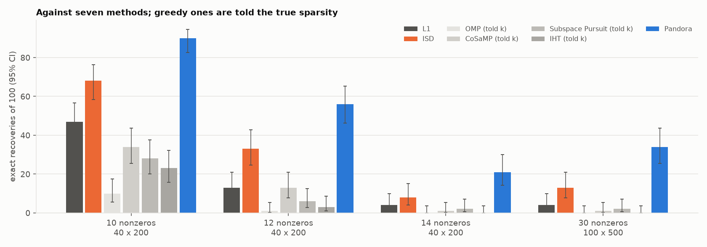
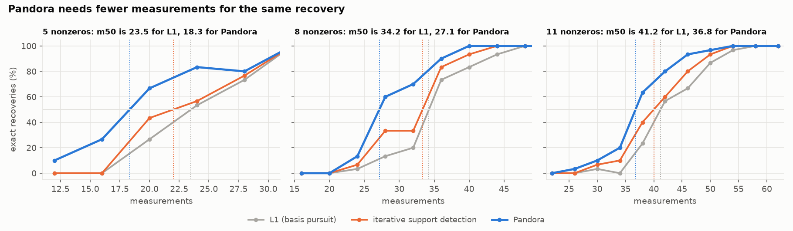
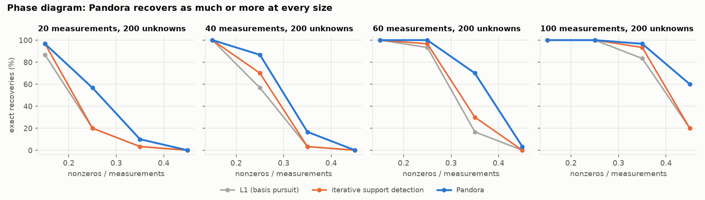
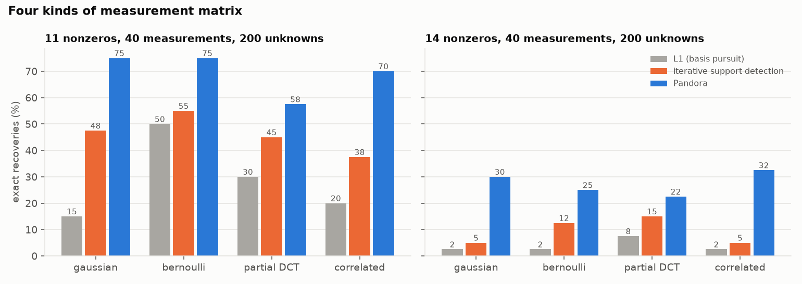

<p align="center">
  <picture>
    <source media="(prefers-color-scheme: dark)" srcset="assets/pandora-dark.svg">
    
  </picture>
</p>

### Certified sparse recovery from many small basis-pursuit solves.

[](https://github.com/EgorKhaklin/pandora/actions/workflows/tests.yml)
[](LICENSE)

You measure `y = X w` with fewer measurements than unknowns, and `w` is sparse. The standard
tool is L1 minimization (basis pursuit), one linear program. Pandora instead opens many small
"vessels": basis pursuit on a few dozen columns at a time. It adds up what each vessel finds,
and stops when the data certify the answer. Every answer it returns has passed an exact-fit
test, so a hit is a recovery, not a guess.

```python
import numpy as np
from pandora import pandora

rng = np.random.default_rng(1)
X = rng.normal(size=(40, 200))                      # 40 measurements, 200 unknowns
w_true = np.zeros(200)
w_true[rng.choice(200, 11, replace=False)] = rng.choice([-1, 1], 11) * rng.uniform(1, 2, 11)
w = pandora(X, X @ w_true, rng=0)                    # None if no certificate within the budget
                                                     # (about 1 problem in 5 at this size)
```

## Results

All results use fresh random problems that were never used to choose settings. Recovery counts
as relative error below 0.01. Everything is in [results/](results) and reruns with the commands
at the bottom.

### Against seven methods



100 problems per cell, with 95% confidence intervals (Wilson). OMP, CoSaMP, Subspace Pursuit
and IHT are given the true number of nonzeros. Pandora is not.

| setting | L1 | ISD | CoSaMP | Subspace Pursuit | IHT | OMP | **Pandora** |
|---|---|---|---|---|---|---|---|
| 40 × 200, 8 nonzeros | 82 | 98 | 72 | 65 | 48 | 32 | **99** |
| 40 × 200, 10 nonzeros | 47 | 68 | 34 | 28 | 23 | 10 | **90** (83–95) |
| 40 × 200, 12 nonzeros | 13 | 33 (25–43) | 13 | 6 | 3 | 1 | **56** (46–65) |
| 40 × 200, 14 nonzeros | 4 | 8 | 1 | 2 | 0 | 0 | **21** (14–30) |
| 100 × 500, 25 nonzeros | 37 | 70 (60–78) | 26 | 26 | 14 | 0 | **76** (67–83) |
| 100 × 500, 30 nonzeros | 4 | 13 (8–21) | 1 | 2 | 0 | 0 | **34** (26–44) |
| 100 × 500, 35 nonzeros | 0 | 0 | 0 | 0 | 0 | 0 | **2** |

ISD is iterative support detection (Wang and Yin, 2010) with threshold `max|w| / 2^(t+1)` and 8
reweighted solves, the strongest baseline here. Pandora is never beaten in these 7 cells, and
where problems are hard its interval sits above ISD's. But every baseline here gets a single run:
ISD solves 9 linear programs, while Pandora averages 34, 107 and 168 at 10, 12 and 14 nonzeros
(40 × 200). The next table evens that out.

### Same budget, same certificate

Pandora's exact-fit certificate (below) can stop any method, so the fair comparison gives ISD the
same stopping rule and budget: restart it from random column weights, each drawn from [0.5, 1.5],
until the certificate passes or 200 linear programs are spent. ISD's threshold for this was tuned
on separate problems; tuning alone did not help single-run ISD (72 / 27 / 9 against 68 / 33 / 8
at 10 / 12 / 14 nonzeros, `benchmarks.validate isdtune`). Paired on the same 40 × 200 problems, 100 per cell:

| nonzeros | problems | ISD restarted | **Pandora** | solved by only one (Pandora / ISD) | p | linear programs | seconds |
|---|---|---|---|---|---|---|---|
| 10 | baseline | 89 | 90 | 6 / 5 | 1.0 | 34 vs 41 | 0.21 vs 0.66 |
| 10 | fresh | 90 | 92 | 6 / 4 | 0.75 | 33 vs 41 | 0.25 vs 0.78 |
| 12 | baseline | 46 | 56 | 18 / 8 | 0.08 | 107 vs 126 | 0.64 vs 2.02 |
| 12 | fresh | 52 | **68** | 23 / 7 | 0.005 | 83 vs 118 | 0.60 vs 2.29 |
| 14 | baseline | 10 | **21** | 12 / 1 | 0.003 | 168 vs 181 | 1.12 vs 3.21 |
| 14 | fresh | 9 | **26** | 18 / 1 | 0.0001 | 161 vs 183 | 1.05 vs 3.17 |

With the same budget and certificate, restarted ISD catches up at 10 nonzeros. At 12 and 14
nonzeros Pandora recovers more in all four rows, significantly in three (p = 0.08 for 12 nonzeros
on the baseline problems), with fewer linear programs, in about a third of the time
(seconds were measured on a busy shared machine, so compare the ratio, not the values). p is an
exact two-sided sign test on the problems that only one method solved (`benchmarks.validate budget`).

### Fewer measurements for the same recovery



Fix the sparsity, vary the number of measurements, and find `m50`, the number of measurements
at which half the problems are recovered (200 unknowns, 30 problems per point; single-run
baselines, as in the first table):

| nonzeros | L1 | ISD | **Pandora** | fewer than L1 | fewer than ISD |
|---|---|---|---|---|---|
| 5 | 23.5 | 22.0 | **18.3** | 22% | 17% |
| 8 | 34.3 | 33.3 | **27.1** | 21% | 19% |
| 11 | 41.2 | 40.0 | **36.8** | 11% | 8% |

### Phase diagram and four kinds of matrix





With Gaussian matrices from 20 to 100 measurements (30 problems per point), and with ±1
entries, rows of a discrete cosine transform and correlated columns (40 problems per cell),
Pandora ties or beats ISD in all 28 cells.

### Larger problems

The same ratio, 1 measurement per 5 unknowns, at growing size (Pandora's budget fixed at 200
vessels; [results/validate_scaling.json](results/validate_scaling.json) when complete):

| unknowns | measurements | nonzeros | L1 | ISD | **Pandora** | Pandora time per problem |
|---|---|---|---|---|---|---|
| 200 | 40 | 12 | 5 | 7 | **19** of 30 | 0.2 s |
| 500 | 100 | 30 | 1 | 5 | **14** of 30 | 2.7 s |
| 1000 | 200 | 50 | 3 | **14** | 13 of 15 | 8.5 s |
| 1000 | 200 | 60 | 0 | 0 | 0 of 15 | 28 s |
| 2000 | 400 | 100 | 4 | 11 | 13 of 15 | 159 s |

The lead holds to 500 unknowns. At 1000 and 2000 Pandora and ISD are level at this budget:
more true columns can sit outside the top group at once, and the chance that one vessel covers
them all falls exponentially in that number (THEORY.md). Whether a larger budget or another
recipe restores the lead is not yet known.

## How it works

1. Solve basis pursuit on all columns, and score each column by `|w|`.
2. Repeat. A vessel is the `n/2` best-scored columns plus `n` random others. Solve basis pursuit
   on the vessel alone: it has `1.5 n` unknowns instead of `d`, a much easier problem. If the
   vessel's solution has fewer than `n` nonzeros (entries above 10⁻⁹ of its largest), run least
   squares on those columns; if that fits `y` exactly, return it and stop. Otherwise update
   `score ← 0.5 · score + |w_vessel|`.
3. Every 5 vessels, run least squares on the `n − 1` best-scored columns. If it fits `y` exactly,
   stop and return it.

"Exactly" means a residual below 10⁻⁸ `‖y‖`. Nothing is returned without passing that
least-squares test. A vessel's sparse-looking solution is never returned as it stands: read off a
sparsity cutoff alone, it can be a dense solution with tiny entries, and wrong.

**Why the stops are certificates** ([THEORY.md](THEORY.md)). For generic `X` and `w`, if fewer
than `n` columns fit `y` exactly, they contain the whole true support, and least squares on
them returns the true `w` (Lemma 1). So a vessel that comes back sparse has recovered `w`
(Corollary 2). This is a stopping rule built on a known fact: a sparse vector is generically
the unique sparsest solution once `n > k` (see, e.g., Baron et al., 2009). In floating point the
test is a tolerance, so it was checked directly: on 500 fresh problems with 8 to 17 nonzeros,
all 269 answers Pandora returned were correct to within 2 × 10⁻¹³, and none was wrong
(`benchmarks.validate certificates`).

## Why it works

Recovery comes down to one question: is the whole true support inside the ranking's top
columns? Out of 60 problems, the top 20 columns contain the entire support this often:

| ranking | 10 nonzeros | 12 nonzeros | 14 nonzeros |
|---|---|---|---|
| random | 0 | 0 | 0 |
| correlation \|Xᵀy\| | 0 | 0 | 0 |
| OMP selection order | 10 | 0 | 0 |
| L1 magnitudes | 33 | 12 | 0 |
| reweighted L1 magnitudes | 34 | 12 | 0 |
| **Pandora scores** | **52** | **40** | **11** |

The median true column ranks nearly the same under L1 and Pandora (5, 7 and 15 against 5, 7
and 13). The difference is in the last few true columns. An L1 solution has at most `n` nonzeros, and every column it sets to
zero gets score 0 and cannot be ranked. Pandora's vessels re-solve smaller problems in which
those columns can come back. A vessel that contains the whole support succeeds with the high
probability basis pursuit has at undersampling `n / 1.5n = 2/3`, compared with `n/d` for the
full problem. [THEORY.md](THEORY.md) proves the certificates and the conditional step, gives
the probability that a vessel covers the support, and states what is still open: a bound on
how fast the scores pull true columns up.

**What each part contributes** (60 problems, 40 × 200):

| variant | 10 nonzeros | 12 nonzeros |
|---|---|---|
| Pandora | 51 | 30 |
| vessels with no bias toward the top columns | 34 | 8 |
| no forgetting (`decay = 1`) | 48 | 19 |
| no randomness (a sliding window of next-best columns) | 55 | 33 |
| vessels of 45 / 50 / 60 / 80 / 120 / 200 columns | 38 / 54 / 51 / 45 / 33 / 33 | 14 / 37 / 30 / 18 / 8 / 8 |

The bias toward the current best columns is the engine. Randomness is not needed. Vessel size
has a sweet spot near `1.25 n` to `1.5 n`. Smaller vessels barely exceed `n` and are hard to
solve. Larger ones are the full problem again: a 200-column vessel scores what L1 does. The
cover-versus-success trade-off in [THEORY.md](THEORY.md) predicts this sweet spot.

## Options

- `pandora(X, y, rng, rounds=200, top=n//2, rest=n, decay=0.5)`. The settings were chosen on
  separate tuning problems. Vessels that scale with `n` matter: a fixed 60-column vessel fell
  behind ISD at 20, 60 and 100 measurements. With `decay=0.3`, found by a second tuning search
  over mixed sparsity, the counts on the 100-problem sets at 8 / 11 / 14 / 17 nonzeros were
  99 / 85 / 30 / 4, against 98 / 80 / 27 / 6 for the default. Each difference is within
  sampling noise, so the default stays.
- `atlas(X, y, sigma, rng)` handles noisy measurements of known noise size `sigma`. Vessels are
  solved by lasso, and the certificate becomes a residual test at the noise floor. At noise 0.05,
  11 nonzeros and 40 measurements, it came within 5% of the truth on 25 of 40 problems, against
  9 for lasso followed by least squares. Needs `pip install 'pandora-cs[noisy]'`.
- Baselines are included for comparison: `basis_pursuit`, `iterative_support_detection`,
  `reweighted_l1`. Greedy baselines are in `benchmarks/greedy.py`.

Variants that did not make the cut: solving each vessel with a small Pandora of its own
recovered 82 and 33 of 100 at 11 and 14 nonzeros (default: 80 and 27), at 3.5 to 4 times the
cost. Nesting deeper lost recoveries and cost up to 7 times more.

## Where it came from

Pandora came out of [charon](https://github.com/EgorKhaklin/charon), a study of what
reparameterizing a weight does to gradient descent. charon's
[THEORY.md](https://github.com/EgorKhaklin/charon/blob/main/THEORY.md) proves that a fixed
elementwise reparameterization can at best tie L1 at finding sparse answers. Past that point
the problem is the ranking, and Pandora builds the ranking from many small solves instead
(charon E16 to E18).

**Related work.** Each part of Pandora has precedent.

- Biased column subsets. Random Lasso (Wang, Nan, Rosset and Zhu, 2011) runs lasso on random
  column subsets, then draws a second round of subsets with probabilities set by the first
  round's coefficients: two rounds, for noisy regression, averaged rather than certified.
  Sequential random subspace selection (Sutera et al., 2018) builds each subset from the
  features found so far plus random others, as a vessel is built, with trees instead of linear
  programs. Iterative random forests (Basu et al., 2018) and iterative RaSE (Tian and Feng,
  2021) also reweight feature sampling round by round. Stability selection (Meinshausen and
  Bühlmann, 2010) scores columns over resamples.
- Linear programs past L1's threshold. Iterative support detection (Wang and Yin, 2010) and
  reweighted L1 (Candès, Wakin and Boyd, 2008) refine a single solve. Two-step reweighted L1
  (Khajehnejad, Xu, Avestimehr and Hassibi, 2010) and modified compressed sensing (Vaswani and
  Lu, 2010) prove that solves steered by a support estimate go past L1's phase transition.
- Re-solving on the best columns plus candidates. Subspace Pursuit (Dai and Milenkovic, 2009)
  and CoSaMP (Needell and Tropp, 2009) do this each round with least squares and a known number
  of nonzeros. They are close to Pandora's deterministic sliding-window variant (see the
  ablations).
- Accepting only an exact fit on chosen columns is the rule of information-set decoding
  (Prange, 1962), over finite fields.

A literature search did not find the combination for noiseless compressed sensing: basis-pursuit
vessels of about `1.5 n` columns, biased by decaying scores over many rounds, and stopped by
exact-fit certificates.

## Limits

- Synthetic problems only: random matrices, signals with random signs and sizes between 1 and
  2, 30 to 100 problems per cell. Nothing here is tested on real data or a physical measurement
  system.
- The exact certificates need noiseless `y`. `atlas` needs the noise level.
- The measurement savings shrink as signals get less sparse (22% at 5 nonzeros, 11% at 11).
- On a classification task with more samples than features (styx's sparse-input task), Pandora
  picked the same inputs as lasso. It helps when there are fewer measurements than unknowns.
- It costs more linear programs than L1: on 40 × 200 problems, about 30 at 10 nonzeros and 100
  at 12, small ones, against L1's one.
- Given the same budget and certificate, restarted ISD matches Pandora at 10 nonzeros
  (40 × 200); the lead remains at 12 and 14 (see Same budget, same certificate).
- Pandora is randomized. On the same 100 problems a second seed gave counts within one of the
  first (98 / 90–91 / 53 / 25 / 2–3 at 8 to 17 nonzeros), but up to 14 individual problems
  changed outcome between the two seeds.
- At a fixed budget of 200 vessels the advantage fades by 1000 unknowns (see Larger problems).
- A re-implementation written from this README alone, sharing no code with the package,
  reproduced the 40 × 200 results: its counts were within or above the intervals here (29% against
  21% at 14 nonzeros, over 400 problems), and its linear-program costs matched. Replication by
  someone outside the project is still the next step.

## Run it

```bash
python -m venv .venv && .venv/bin/pip install -e '.[test,bench]'
.venv/bin/python -m pytest -q                         # 31 tests
.venv/bin/python -m benchmarks.run phase              # phase diagram
.venv/bin/python -m benchmarks.run ensembles          # four matrix kinds
.venv/bin/python -m benchmarks.validate baselines     # seven methods, 95% intervals
.venv/bin/python -m benchmarks.validate ablations     # what each part contributes
.venv/bin/python -m benchmarks.validate budget        # ISD with the same budget and certificate
.venv/bin/python -m benchmarks.validate isdtune       # ISD's threshold, tuned
.venv/bin/python -m benchmarks.validate certificates  # wrong answers returned; a second seed
.venv/bin/python -m benchmarks.measurements           # m50 curves
.venv/bin/python -m benchmarks.ranking                # support inside the top of each ranking
.venv/bin/python -m benchmarks.figures                # figures/ from results/
```

To test a variant of your own, `benchmarks.trial` runs it against Pandora on fixed tuning
problems, then, only if it wins there, on seeds no earlier trial used. The verdict is a paired
sign test, each problem has a time limit, and every trial is logged to `results/ledger.jsonl`:

```bash
.venv/bin/python -m benchmarks.trial my_variant.py:solve --k 11 14   # solve(X, y, rng) -> w or None
```

Seeds are fixed in each script, so reruns reproduce the published numbers.

## License

MIT
